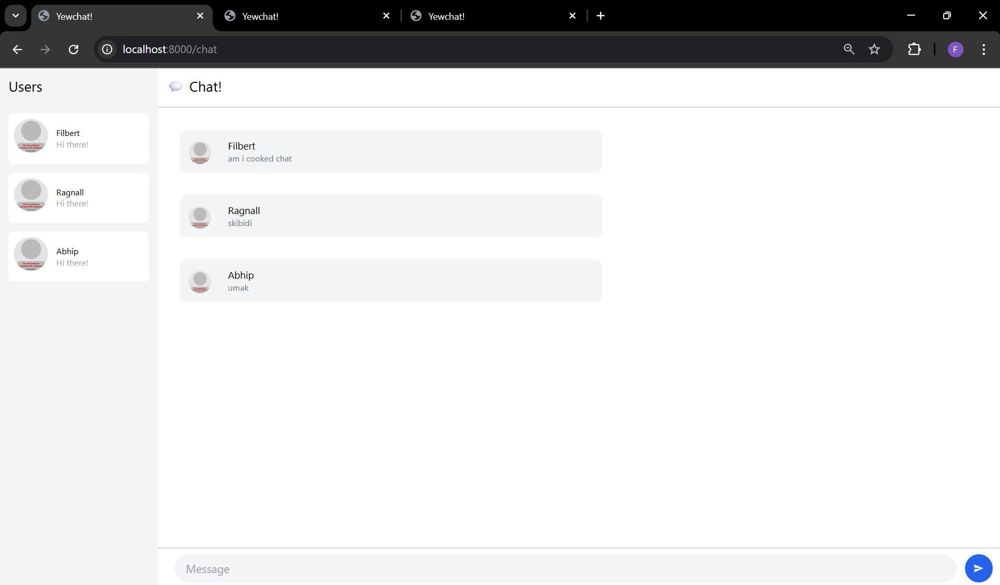

Filbert Aurelian Tjiaranata
2306152336
AdPro B
---

### 1. Original code
Below is the screenshot of 3 Chats after experiments directed by the docs

### 2. Be Creative!

Reflecting on the changes I made to `chat.rs`, I feel a sense of accomplishment in enhancing the user experience of the chat application. Adding the **emoji picker** was a fun and engaging feature to implement. It allows users to express themselves more vividly, making conversations more lively and personal. The challenge was ensuring the picker integrates seamlessly with the input field, and I’m proud of how it turned out.

The **theme switcher** was another creative addition that I’m particularly excited about. It gives users the flexibility to toggle between light and dark modes, catering to their preferences and improving accessibility. Designing the UI to adapt dynamically to the selected theme was a rewarding experience, as it required careful attention to detail in styling.

Overall, these changes not only make the chat app more interactive and visually appealing but also demonstrate my ability to think creatively and implement features that enhance usability. It’s satisfying to see the app evolve into something more user-friendly and fun to use!